# API Schema Relation

This document captures schema/data relation diagrams for all currently available backend APIs. All endpoints are mounted under `/api`.

## 1) POST `/api/search-protocols`
Purpose: Search similar protocols from free text and therapeutic filters.

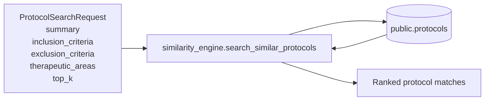

## 2) GET `/api/protocol/{protocol_id}`
Purpose: Return full protocol dashboard payload by protocol id.

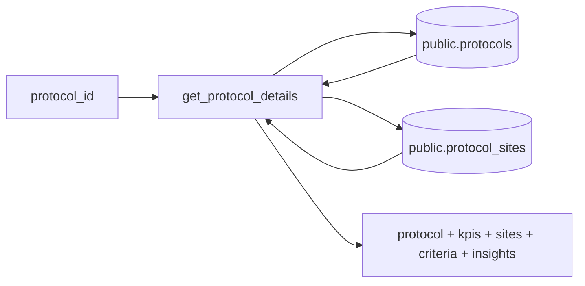

## 3) GET `/api/study-protocol/studies`
Purpose: Paginated and filtered study list.

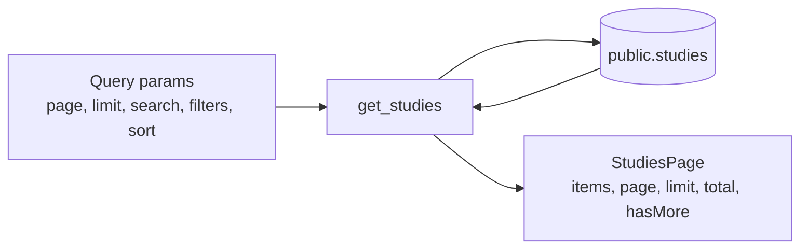

## 4) GET `/api/study-protocol/`
Purpose: Alias endpoint for study list (same logic as `/api/study-protocol/studies`).

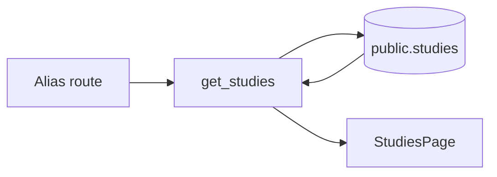

## 5) GET `/api/health`
Purpose: Database connectivity health check.

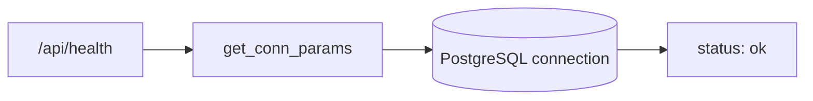

## 6) GET `/api/db/version`
Purpose: Return PostgreSQL server version.

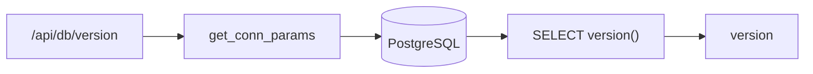

## 8) GET `/api/study-protocol/active-count`
Purpose: Count active studies.

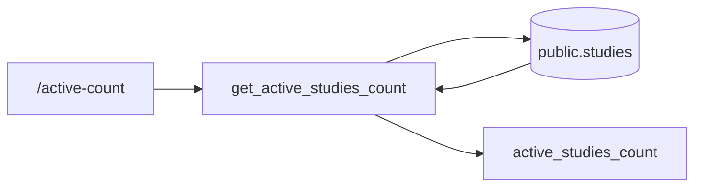

## 9) GET `/api/study-protocol/on-track`
Purpose: Percentage and count of on-track active studies.

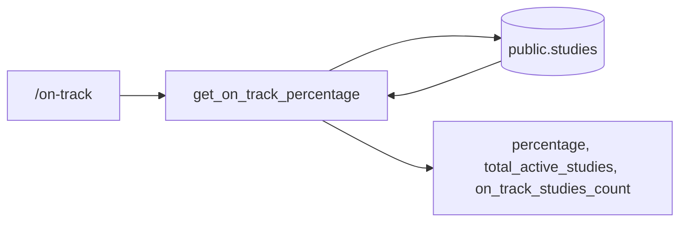

## 10) GET `/api/study-protocol/off-track-or-at-risk`
Purpose: Percentage and count of off-track or at-risk active studies.

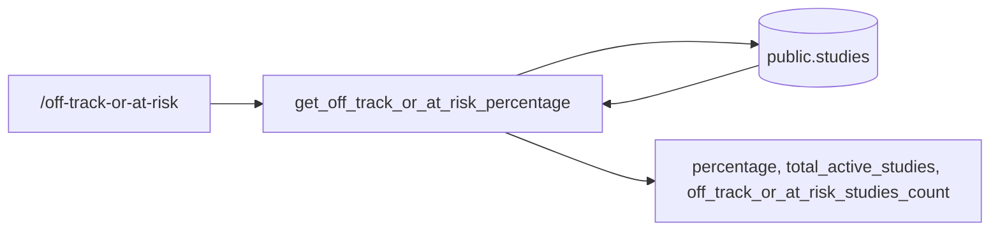

## 11) GET `/api/study-protocol/enrollment-vs-target`
Purpose: Actual vs target enrollment rollup and ratio.

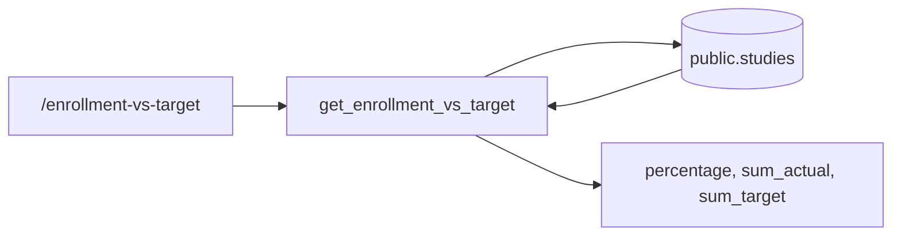

## 12) GET `/api/study-protocol/velocity-vs-plan`
Purpose: Compute average enrollment_plan_percent for active studies.

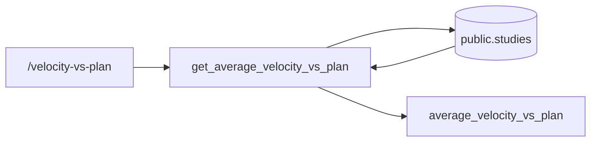

## 13) GET `/api/study-protocol/kpi-details`
Purpose: Combined KPI payload using the same filter set as study listing.

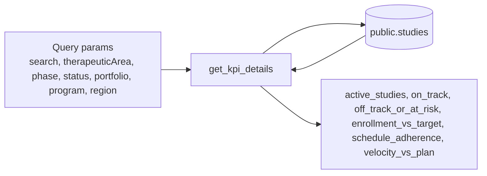