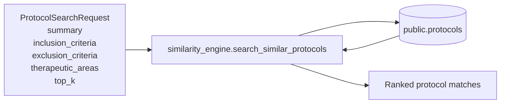
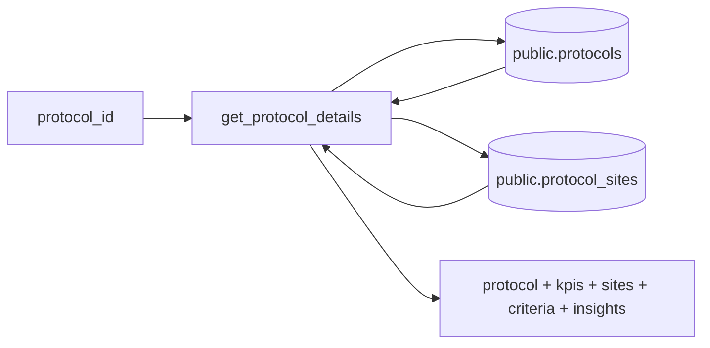
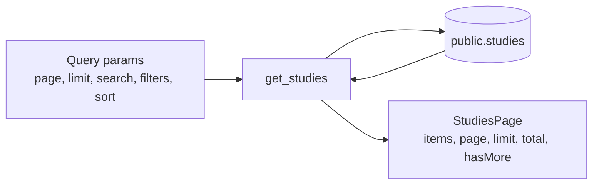
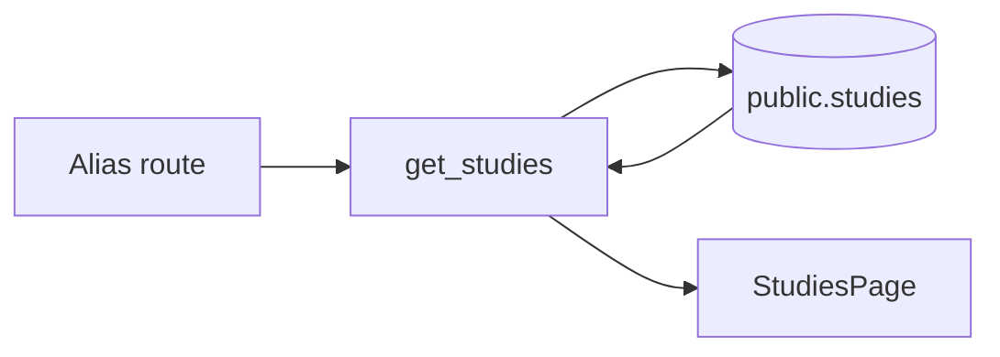

# Backend

## Overview
This folder contains the FastAPI backend for FlightDeck. All routes are mounted under `/api` in `src/main.py`.

## API Schema Relation Document
- Full endpoint schema/data details: [API-SCHEMA-RELATION.md](API-SCHEMA-RELATION.md)
- Versioning and migration approach: [API-VERSIONING.md](API-VERSIONING.md)

### Generate Diagrams In One Command
- Script: [tools/export_api_schema_diagrams.py](tools/export_api_schema_diagrams.py)
- From [apps/backend](apps/backend), run:
```bash
python tools/export_api_schema_diagrams.py
```
- Output directory:
  - Rendered images: `diagrams/api-schema-relations/`
  - Extracted Mermaid files: `diagrams/api-schema-relations/mmd/`

Optional flags:
- `--format png` to export PNG instead of SVG.
- `--extract-only` to only extract `.mmd` files without rendering.

## Structure
- `src/main.py`: API app bootstrap and router registration.
- `src/routers/fd_protocol_similarity.py`: Similarity search and protocol detail endpoints.
- `src/routers/fd_study_protocol.py`: Study list, KPI, health, and DB utility endpoints.
- `src/scripts/similarity_engine.py`: TF-IDF similarity engine used by protocol search.

## Available APIs
### 1) POST `/api/search-protocols`
Purpose: Search similar protocols from free text + therapeutic filters.

Schema relation diagram:


### 2) GET `/api/protocol/{protocol_id}`
Purpose: Return full protocol dashboard payload by protocol id.

Schema relation diagram:


### 3) GET `/api/study-protocol/studies`
Purpose: Paginated and filtered study list.

Schema relation diagram:


### 4) GET `/api/study-protocol/`
Purpose: Alias endpoint for study list (same logic as `/api/study-protocol/studies`).

Schema relation diagram:


### 5) GET `/api/health`
Purpose: Database connectivity health check.

Schema relation diagram:
```mermaid
flowchart LR
  A[/api/health]
  B[get_conn_params]
  C[(PostgreSQL connection)]
  D[{status: ok}]

  A --> B
  B --> C
  C --> D
```

### 6) GET `/api/db/version`
Purpose: Return PostgreSQL server version.

Schema relation diagram:
```mermaid
flowchart LR
  A[/api/db/version]
  B[get_conn_params]
  C[(PostgreSQL)]
  D[SELECT version()]
  E[{version}]

  A --> B
  B --> C
  C --> D
  D --> E
```

### 8) GET `/api/study-protocol/active-count`
Purpose: Count active studies.

Schema relation diagram:
```mermaid
flowchart LR
  A[/active-count]
  B[get_active_studies_count]
  C[(public.studies)]
  D[{active_studies_count}]

  A --> B
  B --> C
  C --> B
  B --> D
```

### 9) GET `/api/study-protocol/on-track`
Purpose: Percentage and count of on-track active studies.

Schema relation diagram:
```mermaid
flowchart LR
  A[/on-track]
  B[get_on_track_percentage]
  C[(public.studies)]
  D[{percentage, total_active_studies, on_track_studies_count}]

  A --> B
  B --> C
  C --> B
  B --> D
```

### 10) GET `/api/study-protocol/off-track-or-at-risk`
Purpose: Percentage and count of off-track or at-risk active studies.

Schema relation diagram:
```mermaid
flowchart LR
  A[/off-track-or-at-risk]
  B[get_off_track_or_at_risk_percentage]
  C[(public.studies)]
  D[{percentage, total_active_studies, off_track_or_at_risk_studies_count}]

  A --> B
  B --> C
  C --> B
  B --> D
```

### 11) GET `/api/study-protocol/enrollment-vs-target`
Purpose: Actual vs target enrollment rollup and ratio.

Schema relation diagram:
```mermaid
flowchart LR
  A[/enrollment-vs-target]
  B[get_enrollment_vs_target]
  C[(public.studies)]
  D[{percentage, sum_actual, sum_target}]

  A --> B
  B --> C
  C --> B
  B --> D
```

### 12) GET `/api/study-protocol/velocity-vs-plan`
Purpose: Compute average enrollment_plan_percent for active studies.

Schema relation diagram:
```mermaid
flowchart LR
  A[/velocity-vs-plan]
  B[get_average_velocity_vs_plan]
  C[(public.studies)]
  D[average_velocity_vs_plan]

  A --> B
  B --> C
  C --> B
  B --> D
```

### 13) GET `/api/study-protocol/kpi-details`
Purpose: Combined KPI payload using the same filter set as study listing.

Schema relation diagram:
```mermaid
flowchart LR
  A[Query params\nsearch, therapeuticArea, phase, status, portfolio, program, region]
  B[get_kpi_details]
  C[(public.studies)]
  D[{active_studies, on_track, off_track_or_at_risk, enrollment_vs_target, schedule_adherence, velocity_vs_plan}]

  A --> B
  B --> C
  C --> B
  B --> D
```

### 14) GET `/api/protocols/summary`
Purpose: Return total number of protocols and number of distinct therapeutic areas in a single payload.

Request URL:
- `/api/protocols/summary`
- `/api/v1/protocols/summary`

Output format:
```json
{
  "success": true,
  "protocolCount": 123,
  "distinctTherapeuticAreaCount": 9
}
```

Schema relation diagram:
```mermaid
flowchart LR
  A[/protocols/summary]
  B[(public.protocols)]
  C[COUNT(*) as protocolCount]
  D[COUNT(DISTINCT therapeutic_area) as distinctTherapeuticAreaCount]
  E[{success, protocolCount, distinctTherapeuticAreaCount}]

  A --> B
  B --> C
  B --> D
  C --> E
  D --> E
```

## Setup
1. Install dependencies.
```bash
pip install -r requirements.txt
```
2. Run DB init checks (no schema/table creation).
```bash
python -m eagle_hackathon.apps.backend.src.scripts.init_db
```
3. Run the backend using the main entrypoint.
```bash
python -m uvicorn eagle_hackathon.apps.backend.src.main:app --host 0.0.0.0 --port 8000
```

## Testing
Run pytest for backend checks:
```bash
pytest eagle_hackathon/apps/backend/tests -q
```

## API Versioning
- Backward compatible routes: `/api/...`
- Versioned routes: `/api/v1/...`

Use `/api/v1` for new clients while keeping `/api` alive during migrations.

## Migration And DB Init Strategy
- No schema/table creation is executed by backend APIs.
- Environment-ready DB init check scripts:
  - `scripts/env/dev/init_db.ps1`
  - `scripts/env/prod/init_db.ps1`
- Shared configuration template: `config/.env.example`

## Notes
- Set DB env vars before running: `PGHOST`, `PGUSER`, `PGPORT`, `PGDATABASE`, `PGPASSWORD`.
- Router sources: `src/routers/fd_protocol_similarity.py` and `src/routers/fd_study_protocol.py`.